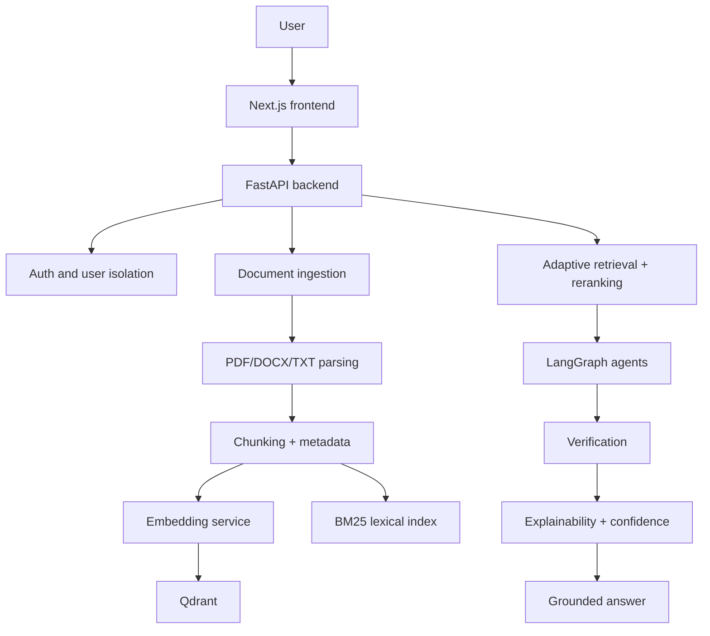

# AdaptiveDocAI Architecture

## Overview

AdaptiveDocAI is a trustworthy document intelligence platform designed for academic and enterprise document analysis. It combines adaptive retrieval, multi-agent orchestration, and evidence-based verification to answer questions with grounded citations and transparent confidence.

## Core design principles

- Retrieval strategy selection is explicit and interpretable.
- Evidence is treated as untrusted data, not as instructions.
- Every final answer must attach source evidence and verification outcomes.
- The system keeps user-level isolation for all document operations.
- The project supports both local development and Docker-based deployment.

## High-level system flow

## Repository alignment

The current repository contains a working prototype foundation with:

- FastAPI backend structure
- JWT auth routes
- document upload routes
- basic retrieval and evaluation code
- Vite + React frontend shell

The implementation is being evolved toward the full research architecture described in the project brief.

## Recommended production structure

- Frontend: React + TypeScript + Vite
- Backend: FastAPI + SQLAlchemy
- Database: PostgreSQL
- Dense vector DB: Qdrant
- Retrieval: BM25 + dense + hybrid + reranking
- Orchestration: LangGraph
- Verification: claim/evidence comparison
- Evaluation: reproducible benchmark runner and metrics export

## Phase 1 objective

This phase establishes the foundation and ensures the project is runnable and consistent with the research direction:

- project identity and docs
- environment configuration
- backend/frontend health checks
- auth and user model structure
- modular service layout for future phases

## Research-critical components

### Adaptive retrieval router

The router should classify user questions by lexical density, ambiguity, and semantic complexity before choosing BM25, Dense, or Hybrid retrieval.

### Evidence verification

Generated claims are checked against retrieved evidence using structured status labels such as SUPPORTED, PARTIALLY_SUPPORTED, UNSUPPORTED, and CONTRADICTED.

### Explainability

Every answer should provide:

- confidence level
- verification status
- supporting sources
- relevant evidence excerpts
- retrieval strategy used

## Operational constraints

- Never log secrets.
- Never fabricate citations or experimental results.
- User isolation is mandatory for every document access path.
- AI functionality must fail gracefully when LLM credentials are absent.

## Future phases

The project will proceed through the phases described in the implementation brief, moving from configuration and auth to retrieval, agents, evaluation, and deployment.
